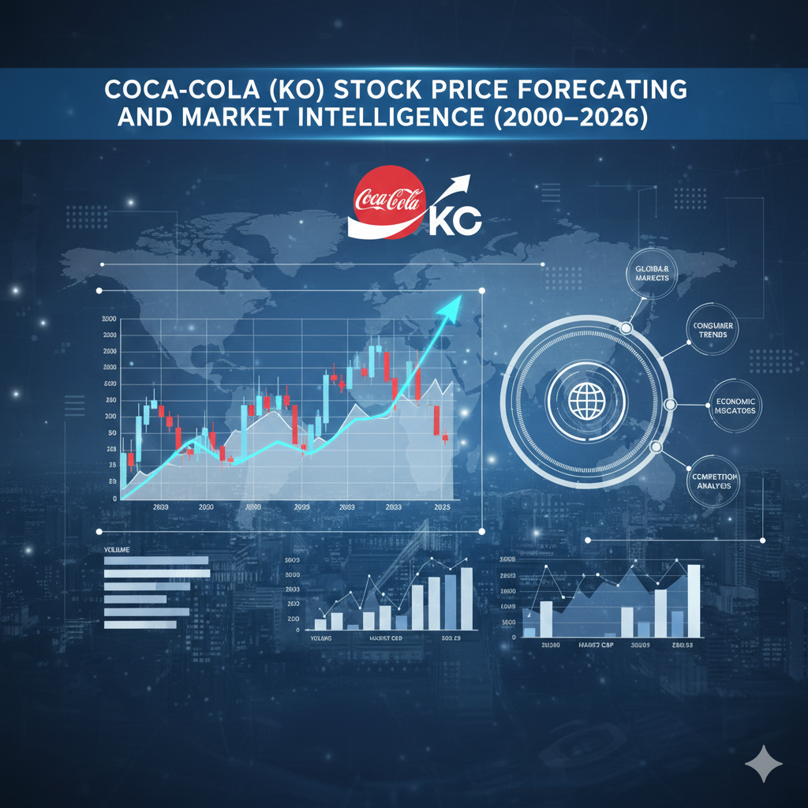

  

 

# Coca-Cola (KO) Stock Price Forecasting and Market Intelligence PRD

## 1) Project Overview

This project builds a reproducible data-science workflow for **The Coca-Cola Company (ticker: KO)** using historical daily market data (OHLCV: Open, High, Low, Close, Volume).  
Primary goal: support exploratory analysis, feature engineering, and forecasting/classification tasks for price movement, volatility, and trading behavior.

## 2) SEO-Optimized Name and Description

- **SEO Project Name:** Coca-Cola KO Stock Price Prediction Dataset (2000-2026)
- **SEO Description:** A clean, long-range KO stock market dataset with daily OHLCV records from 2000 to 2026, ideal for time-series forecasting, volatility modeling, quantitative finance research, and Kaggle machine learning competitions.

## 3) Dataset Snapshot

- **Dataset file:** `KO.csv`
- **Records (rows):** 6,559 daily observations
- **Columns:** 6
- **Temporal range:** `01/03/2000` to `01/30/2026`
- **Entity:** The Coca-Cola Company (KO)
- **Granularity:** Daily trading data (market trading days; weekends/market holidays not included)

## 4) Data Dictionary (Columns and Details)

| Column | Type | Example | Description | Typical Constraints/Notes |
|---|---|---|---|---|
| `Date` | Date (MM/DD/YYYY) | `1/3/2000` | Trading date for KO record. | Should be unique per trading day; chronological index for time-series modeling. |
| `Close` | Float | `13.61495495` | End-of-day closing price. | Usually between `Low` and `High`; core target for forecasting tasks. |
| `High` | Float | `14.00740376` | Highest traded price during the day. | Should be >= `Open` and >= `Close` in standard OHLC logic. |
| `Low` | Float | `13.34325962` | Lowest traded price during the day. | Should be <= `Open` and <= `Close` in standard OHLC logic. |
| `Open` | Float | `14.00740376` | Opening traded price for the day. | First regular-session trade reference for daily candles. |
| `Volume` | Integer (shares) | `10997000` | Total traded shares during the session. | Non-negative; can be used for liquidity, momentum, and event impact features. |

### Recommended derived features for Kaggle notebooks

- Daily return: `(Close_t / Close_{t-1}) - 1`
- Intraday range: `High - Low`
- Gap: `Open_t - Close_{t-1}`
- Rolling volatility (e.g., 5/20/60-day std of returns)
- Rolling volume z-score and moving averages

## 5) Kaggle Dataset Metadata (Suggested)

### Top 5 tags (project + dataset)

1. `finance`
2. `stock-market`
3. `time-series`
4. `forecasting`
5. `coca-cola`

### Kaggle-compatible short subtitle

Daily KO OHLCV market data (2000-2026) for forecasting and quantitative analysis.

## 6) Dataset Coverage

- **Coverage breadth:** Single-instrument coverage focused on KO equity market behavior.
- **Coverage depth:** 26+ years of daily data, covering multiple macro cycles (dot-com aftermath, 2008 crisis era, COVID period, inflation/rate-hike period, and recent post-2020 market regimes).
- **Coverage limitations:** No intraday tick-level data, no order-book data, no corporate fundamentals, no direct macroeconomic variables in this file.
- **Population represented:** Daily public-market trades for KO on U.S. exchange trading sessions.

## 7) Temporal and Geospatial Scope

- **Start date (MM/DD/YYYY):** `01/03/2000`
- **End date (MM/DD/YYYY):** `01/30/2026`
- **Temporal unit:** 1 trading day
- **Geospatial scope:** United States market context (KO is U.S.-listed on NYSE).
- **Relevant city/country:** Primary exchange context in the U.S. (NYSE, New York, USA); issuer headquarters context: Atlanta, Georgia, USA.

## 8) Provenance (Source + Transformations)

### Data source provenance

The dataset structure and values are consistent with historical market OHLCV exports commonly distributed by financial market data providers for ticker **KO**.

- **Primary suggested source:** Yahoo Finance historical data for KO  
  Link: <https://finance.yahoo.com/quote/KO/history>

### Transformations used/expected

- Extract historical KO daily records from source provider.
- Keep core columns: `Date, Close, High, Low, Open, Volume`.
- Save as CSV.
- Preserve trading-day rows only (non-trading days absent).
- Optional preprocessing for modeling:
  - sort by `Date` ascending,
  - parse `Date` to datetime,
  - validate OHLC constraints,
  - create lag/rolling features.

## 9) Dataset Collection Methodology

1. Select instrument ticker: `KO`.
2. Query historical daily candles from a market data source.
3. Export OHLCV data into flat-file CSV format.
4. Perform quality checks:
   - schema validation (6 expected columns),
   - date parsing and continuity checks for trading days,
   - numeric type validation for OHLC and volume.
5. Version dataset snapshots to keep reproducibility over time as new rows are appended.

## 10) Biggest Problems and Challenges

1. **Non-stationarity/regime shifts:** Market behavior changes over decades; models degrade when regimes change.
2. **External drivers missing:** Prices are influenced by macro news, rates, FX, commodities, and earnings events not present in this file.
3. **Potential corporate action effects:** Stock splits/dividends and adjustment conventions may differ by source and can affect comparability.
4. **Limited feature space:** Only OHLCV may underfit complex dynamics without engineered features or exogenous data.
5. **Evaluation leakage risk:** Time-series tasks require strict chronological train/validation splits; random splits produce misleading results.
6. **Single-ticker generalization risk:** Findings may not generalize to other assets or sectors.

## 11) Recommended PRD Success Criteria

- Build a reproducible EDA and modeling pipeline.
- Use walk-forward validation only.
- Track MAE/RMSE/MAPE for regression and direction-accuracy for classification.
- Publish notebook(s) with clear assumptions, limitations, and data provenance.

## 12) Source Reference (for citation in Kaggle page)

- Yahoo Finance, KO Historical Data: <https://finance.yahoo.com/quote/KO/history>
- Company context: The Coca-Cola Company investor site: <https://investors.coca-colacompany.com>

